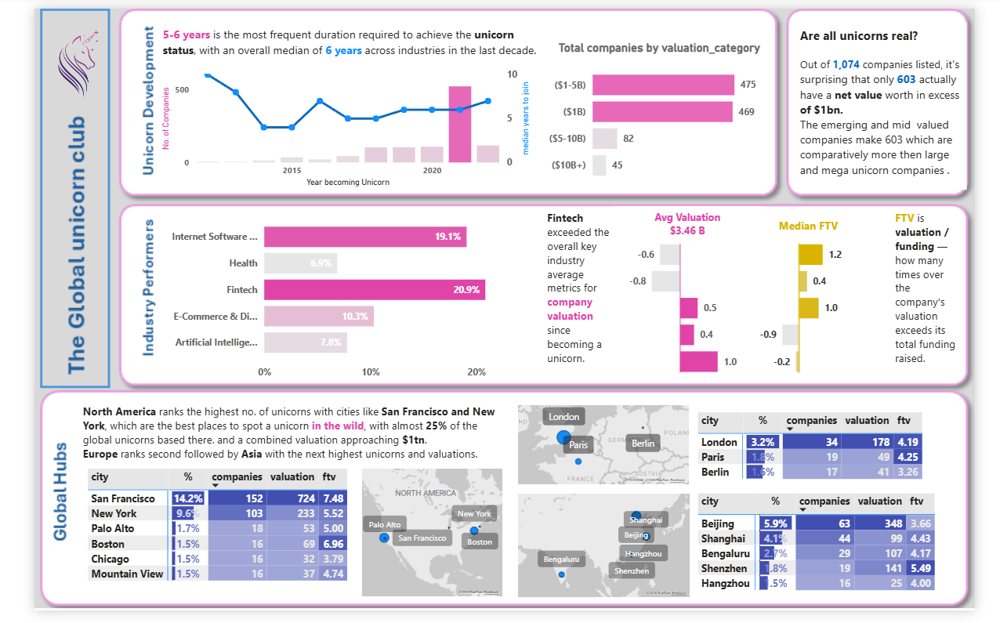

<h1 align="center">Global Unicorn Companies – Analytics Dashboard</h1>

<p align="center">
<b>Python + PostgreSQL + Power BI | Maven Unicorns Dataset</b>
</p>

<p align="center">
  
  
  
  
  
  
  
</p>

This project analyzes 1,074 global unicorn companies to answer a question most dashboards skip: not just *who's worth the most*, but *who's creating value most efficiently*, and *how concentrated is the unicorn landscape really*.



## The Short Version

1,074 unicorn companies. $3.71 trillion in combined valuation. Out of all companies listed, only 603 actually have a net value in excess of $1bn once funding raised is deducted — a number most raw valuation rankings never surface.

Fintech leads industry performance with a 20.9% share and the highest average valuation at $3.46B. San Francisco alone hosts 152 unicorns worth a combined $724B. Median time to reach unicorn status is 6 years. The dashboard turns these signals into three connected views: development over time, industry performance, and global hub concentration.

---

## Key Outcomes

- Built a Python ETL pipeline in Jupyter — null imputation, unit normalisation, industry name standardisation, derived feature engineering, and IQR-based outlier detection — on a raw dataset with real data quality issues
- Designed and built a star schema (1 fact table + 3 dimension tables) with explicit foreign key constraints, written directly in SQL
- Loaded the cleaned dataset into PostgreSQL using `psql`'s `\copy` command, with schema iteration along the way (dropping unused columns post-load based on what was actually exported)
- Connected Power BI directly to PostgreSQL and built a 3-section dashboard using DAX measures for capital efficiency (FTV), industry deviation-from-average, and geographic concentration
- Verified every dimension table merge for referential integrity before loading — zero orphaned foreign keys in the final fact table

---

## What Makes This Project Different

Most portfolio dashboards stop at "top 10 by valuation." This project asks a sharper question: out of every company labeled a "unicorn," how many actually hold a net value above $1B once funding raised is subtracted? The answer — 603 out of 1,074 — is the kind of insight that only emerges once valuation and funding are treated as two separate signals instead of one.

The project also reflects a realistic, slightly messy build process rather than a polished-after-the-fact one: the SQL schema was originally designed with more columns (GDP enrichment, outlier flags) than what ended up in the final CSV export, so those columns were explicitly dropped post-load via `ALTER TABLE` once the real export shape was confirmed. That kind of schema correction is a normal part of real data engineering work, and it's left visible here rather than cleaned up after the fact.

---

## The Core Problem

A list of the world's most valuable startups is interesting for about thirty seconds. It doesn't tell you which industries are most efficient at turning funding into value, or where in the world unicorns are most concentrated.

This project builds the layer underneath the obvious ranking: a clean, queryable star schema that supports capital efficiency analysis (FTV ratio — funding to valuation), industry-level performance comparison against the overall average, and city/country-level hub analysis.

---


---

## How This System Works

```
Python (Jupyter Notebook)
└── Extracts, cleans, and transforms the raw dataset
    (null imputation, unit normalisation, industry standardisation,
     derived features, investor parsing, outlier detection)

CSV Export
└── Cleaned data split into star-schema-ready tables
    (fact_unicorn, dim_industry, dim_geography, dim_investor)

PostgreSQL
└── Schema created via SQL DDL, tables loaded via \copy
    (foreign key constraints enforced, schema corrected post-load)

Power BI
└── Connected directly to PostgreSQL
    (3-section dashboard: Development, Industry Performers, Global Hubs)
```

```
Raw Dataset (1,074 rows | 11 columns)
         ↓
  Python — Null handling (city, funding, investors)
         ↓
  Python — Unit normalisation (valuation/funding → billions)
         ↓
  Python — Industry name standardisation (casing fix)
         ↓
  Python — Derived features (years_to_unicorn, FTV, VTF, valuation_tier)
         ↓
  Python — Outlier detection (IQR method, flagged not removed)
         ↓
  CSV Export — fact_unicorn + 3 dimension tables
         ↓
  PostgreSQL — Schema (schema.sql) + \copy load + post-load column cleanup
         ↓
  Power BI — Direct PostgreSQL connection, DAX measures, 3-page dashboard
```

---

## Key Business Insights

**Insight 1 — Less than 60% of "unicorns" actually clear $1B in net value**

Out of 1,074 companies listed, only 603 have a net value (valuation minus total funding raised) in excess of $1B. The remaining companies hold high valuations on paper, but a meaningful share of that valuation reflects capital raised rather than value created. This single comparison reframes the entire dataset.

**Insight 2 — Fintech leads on both volume and quality**

Fintech accounts for 20.9% of all unicorns — the largest single industry share — and also exceeds the overall average company valuation, reaching $3.46B average. Industries that lead on count don't always lead on value; Fintech does both.

**Insight 3 — Capital efficiency varies independently of industry size**

The FTV ratio (funding-to-valuation, where a higher multiplier means a company created more value per dollar raised) shows Fintech and Internet Software with the strongest median ratios of 1.2 and 1.0 respectively, while Artificial Intelligence — despite being the 4th largest industry by count — shows a negative deviation of -0.2 from the overall median, signalling comparatively heavier capital usage relative to value created.

**Insight 4 — Unicorn creation is geographically concentrated, not evenly spread**

San Francisco alone accounts for 14.2% of all global unicorns (152 companies, $724B combined valuation), with New York adding another 9.6%. North American cities combined represent close to a quarter of the entire global dataset, with Europe (London, Paris, Berlin) and Asia (Beijing, Shanghai, Bengaluru) following as the next-largest hub clusters.

**Insight 5 — Outliers are flagged, not removed**

Using the IQR method on valuation, statistical outliers were identified and explicitly tagged rather than filtered out. Removing the highest-valued companies from a unicorn dataset would defeat the purpose of the analysis — they represent some of the most informative data points, not noise to be cleaned away.

---

## What the Numbers Show

| Metric | Value |
|---|---|
| Total Companies | 1,074 |
| Companies with Net Value > $1B | 603 |
| Total Combined Valuation | $3.71T |
| Countries Represented | 46 |
| Industries Represented | 15 |
| Median Years to Unicorn Status | 6 years |
| Highest-Valued Company | ByteDance — $180B |
| Most Capital-Efficient Company | Zapier — 4,000x valuation/funding |
| Top Industry by Share | Fintech — 20.9% |
| Top Industry by Avg Valuation | Fintech — $3.46B |
| Top Hub City | San Francisco — 152 companies, $724B |

---

## Star Schema Design

A unicorn's valuation alone doesn't explain how efficiently it was built or where unicorn activity actually concentrates. Answering those questions required a proper dimensional model rather than one flat table.

```
                    dim_geography
                         │
dim_industry ─────  fact_unicorn
                         │
                    dim_investor
```

**Design decisions worth explaining:**

- **`dim_investor` is long-format and many-to-one.** The raw `investors` column held multiple investor names in a single comma-separated cell — a First Normal Form violation. Exploding it into one row per (company, investor) pair (3,051 rows across 1,253 unique investors) makes investor-level analysis possible, which a single string column never could.
- **Surrogate keys (`geo_id`, `industry_id`) were generated in Python, not in PostgreSQL.** Both dimension tables were deduplicated and assigned sequential IDs before export, so the fact table's foreign keys were already correct on load — PostgreSQL's job was enforcing the constraint, not generating the key.
- **The schema was corrected after the real export shape was known.** The original `schema.sql` included GDP enrichment and outlier-flag columns that weren't present in the actual cleaned export. Rather than silently mismatching the `\copy` load, those columns were explicitly dropped via `ALTER TABLE` once the true 17-column shape of `fact_unicorn.csv` was confirmed.

---

## Tools & Stack

| Tool | Purpose |
|---|---|
| **Python (Pandas, NumPy)** | Data cleaning, transformation, feature engineering — in Jupyter Notebook |
| **PostgreSQL** | Star schema warehouse — DDL, foreign key constraints, `\copy` bulk load |
| **Power BI** | 3-section dashboard, DAX measures, direct PostgreSQL connection |

---

## Business Focus Areas

- Net value analysis (valuation minus funding raised, not valuation alone)
- Capital efficiency by industry (FTV ratio, deviation from overall average)
- Industry performance benchmarking against the overall key metric average
- Geographic concentration of unicorn creation by city, country, and continent
- Outlier-aware reporting (statistical flags retained, not silently removed)

---

## Dataset

**Name:** Maven Unicorns Dataset
**Size:** 1,074 rows | 11 columns (raw)
**Source columns:** company, valuation, year_joined, industry, city, country, continent, year_founded, funding, investors

| Column | Description |
|---|---|
| company | Company name |
| valuation | Valuation in raw USD |
| year_joined | Year the company reached unicorn status |
| year_founded | Year the company was founded |
| industry | Industry category |
| city / country / continent | Headquarters location |
| funding | Total funding raised, in raw USD |
| investors | Comma-separated list of investors |

---

## Python Pipeline

| Notebook | What It Does |
|---|---|
| `etl_unicorn.ipynb` | Full pipeline: null handling, unit normalisation, industry standardisation, derived features (years_to_unicorn, FTV, VTF, valuation_tier), investor parsing, IQR outlier detection, and final export of `fact_unicorn` + 3 dimension tables |

---

## SQL Schema

| File | What It Does |
|---|---|
| `schema.sql` | Creates `dim_geography`, `dim_industry`, `dim_investor`, and `fact_unicorn` with primary/foreign key constraints; includes the `\copy` load commands and post-load `ALTER TABLE` cleanup |

---

## DAX Measures

| Measure | Purpose |
|---|---|
| Avg Valuation | `AVERAGE(fact_unicorn[valuation_B])` |
| Avg Valuation Deviation | Industry average minus overall average — powers the deviation bar chart |
| Median FTV | `MEDIAN` of funding-to-valuation ratio per industry |
| % of Industry | Each industry's share of total unicorn count |

---

## Project Structure

```
unicorn-analytics-dashboard/
│
├── data/
│   ├── raw/
│   │   └── new_unicorn_Companies.csv
│   └── cleaned/
│       ├── fact_unicorn.csv
│       ├── dim_industry.csv
│       ├── dim_geography.csv
│       └── dim_investor.csv
│
├── python/
│   └── etl_unicorn.ipynb
│
├── sql/
│   └── schema.sql
│
├── dashboard/
│   └── unicorn_dashboard.pbix
│
├── screenshots/
│   └── 01_dashboard_overview.png
│
└── README.md
```

---

## Limitations

- The dataset captures a single valuation snapshot per company, not historical valuation over time — true year-over-year growth per company is not measurable with this data
- Funding nulls were imputed using industry-level median, which is a reasonable estimate but not the company's actual reported funding figure
- The `schema.sql` file reflects two design iterations — the original DDL included columns (GDP, outlier flags) that were later dropped once the real export shape was confirmed; this is intentional and documented above, not an oversight
- Outlier companies (ByteDance, SHEIN, SpaceX, etc.) are retained and flagged rather than removed, which means simple averages can be heavily influenced by a small number of mega-valuation companies

This system is built for exploratory and educational analysis. It is not a substitute for a verified, audited financial dataset.

---

## How to Run This

**Step 1 — Get the dataset**

The raw Maven Unicorns CSV is included in `data/raw/`.

**Step 2 — Run the Python ETL notebook**

```bash
pip install pandas numpy jupyter
jupyter notebook python/etl_unicorn.ipynb
```

Run all cells in order. This produces `cleaned_unicorns.csv` and exports `fact_unicorn.csv`, `dim_industry.csv`, `dim_geography.csv`, and `dim_investor.csv` into `data/cleaned/`.

**Step 3 — Create the PostgreSQL schema**

```bash
psql -U postgres -d unicorn_db -f sql/schema.sql
```

**Step 4 — Load the data**

In `psql`, update the file paths in `schema.sql`'s `\copy` commands to point to your local `data/cleaned/` folder, then run them in order: `dim_geography` → `dim_investor` → `fact_unicorn`.

**Step 5 — Open Power BI**

- Open `dashboard/unicorn_dashboard.pbix`
- If prompted, update the PostgreSQL connection details (host, port, database, credentials)
- Click Refresh to reload all 4 tables

---

## Skills Demonstrated

`Python` `Pandas` `NumPy` `Jupyter` `SQL` `PostgreSQL` `Power BI` `DAX` `Star Schema Design` `ETL Pipeline Design` `Data Cleaning` `Feature Engineering` `Outlier Detection` `Business Analytics` `Data Storytelling`

---

## Author

**Rajkunwar Mane**

[LinkedIn](https://www.linkedin.com/in/rajkunwar-mane-241225295/)
